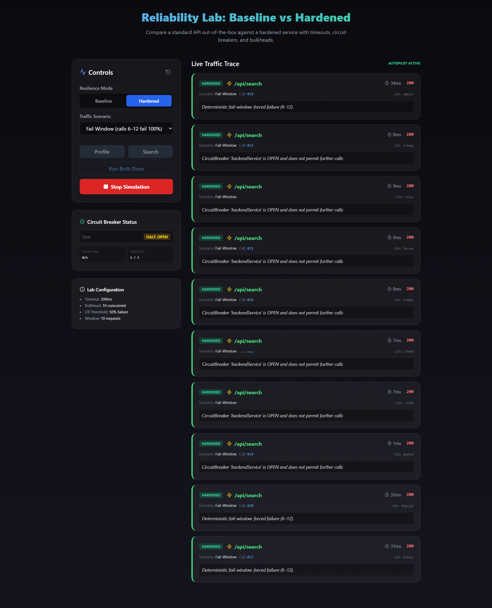

# Baseline-to-Hardened Reliability Lab

A hands-on demonstration of how Spring Boot APIs behave under stress and how Resilience4j can protect the system and improve User Experience (UX).



## What this Lab Demonstrates
1.  **Naive API (Baseline)**: Without protection, a slow dependency causes the entire request/thread to hang. The UI becomes unresponsive, and the failure bubbles up slowly.
2.  **Hardened API**: Using timeouts, circuit breakers, and bulkheads to "fail fast".
    *   **Timeout**: If a dependency is slow, cut it off early (e.g., 200ms) to keep the system responsive.
    *   **Circuit Breaker**: If failures mount, stop trying to call the broken dependency entirely for a period.
    *   **Bulkhead**: Limit concurrent calls to a specific dependency so one slow service doesn't starve the whole thread pool.

## Documentation
Additional guides for engineers and architects are available in the `/doc` folder:
*   [Application Remediation & Resilience Guide](./doc/remediation-guide.md): Learn how to translate lab signals into production fixes and explore real-world use cases.

## Quick Start

### 1. Start Backend (Spring Boot)
Requires Java 17+ and Maven.
```bash
cd backend
mvn spring-boot:run
```
Runs on http://localhost:8080*

### 2. Run with Docker (Recommended)
If you have Docker and Docker Compose installed:
```bash
docker-compose up --build
```
*Backend: http://localhost:8080*
*Frontend: http://localhost:3000*

## The Demo Path

### Step 1: The "Hanging UI" (Baseline + Slow)
1. Set Mode to **Baseline**.
2. Set Scenario to **Slow**.
3. Click **Run Search**.
4. **Observe**: The request takes ~400ms+. In a real app with 10s timeouts, the browser tab would feel "stuck".

### Step 2: The "Fail Fast" (Hardened + Slow)
1. Set Mode to **Hardened**.
2. Keep Scenario **Slow**.
3. Click **Run Search**.
4. **Observe**: The request returns in ~200ms with a **504 Gateway Timeout**. This is a controlled failure that returns control to the user quickly.

### Step 3: The "Circuit Breaker" (Hardened + Fail)
1. Set Mode to **Hardened**.
2. Set Scenario to **Fail**.
3. Click **Run Both** multiple times.
4. **Observe**: Initially, you see **502 Bad Gateway** (random 30% failures). Once enough failures occur, the status changes to **503 Service Unavailable** with very low latency (~1ms). This is the Circuit Breaker "opening" to protect the system.

### Step 4: The Automation & Status (Fail Window)
This is the most powerful demo:
1.  Set Mode to **Hardened**.
2.  Set Scenario to **Fail Window (6-12s / 100%)**.
3.  Click **Start continuous traffic**.
4.  **Observe**:
    *   **0-5s**: Green success calls.
    *   **6-8s**: Red **502 Bad Gateway** errors start as the window hits.
    *   **9-12s**: After enough failures, observe the **Circuit Breaker Status** widget change to **OPEN**.
    *   **Instant Result**: Future calls return **503 Service Unavailable** in ~1ms (short-circuited).
    *   **>13s**: The window closes. The CB will eventually transition to **HALF_OPEN** and then **CLOSED** as traffic succeeds again.

### Step 5: Resetting the Lab
*   Use the **Rotate icon** next to "Controls" to reset the backend timer and the Circuit Breaker manually at any time.


## Key Takeaways
*   **Slow is worse than Down**: A dead service is easy to handle; a slow service can bring down your entire fleet by pinning threads.
*   **Fail Fast**: Protect the user's time. 200ms and a failure message is better than 10 seconds and "it might work".
*   **Controlled Failure**: Use HTTP 504 (timeout) vs 503 (short-circuited) to signal different system states to downstream consumers.
*   **Self-Healing**: Observe how a Circuit Breaker automatically recovers when the dependency stabilizes.
*   **Shared Responsibility**: Reliability is implemented in the backend, but its value is realized in the UI response.
